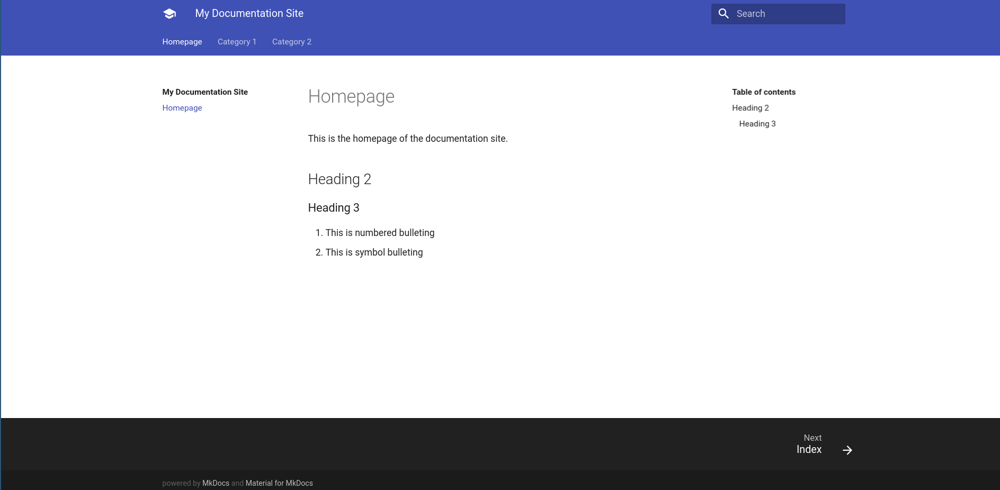

# How to Create a Documentation site

This is a simple tutorial on how to set up a documentation site using mkDocs. mkDocs is a Python based documentation application that uses Markdown formatting - just another text format found for easier documentation. 

To use mkDocs, we will need Python and Pip already present in the machine. Once we have both, we can install mkdocs by,

```
python3 -m pip install mkdocs mkdocs-material
```

The reason why we install `mkdocs-material` is because, it provides a better UI compared to the default theme. Once we have the required packages ready. We can clone the template site created from the Github Link - [How to Create a documentation site](https://github.com/suneshgovind/how-to-create-a-documentation-site)

```bash
git clone git@github.com:suneshgovind/how-to-create-a-documentation-site.git
```

Once done, you can see the folder structure of the repo like below,

````
docs
  - index.md
  - category-1/
    -- index.md
    -- sample-page.md
  - category-2/
    -- index.md
    -- sample-page.md
````

All documentation goes into the `docs` directory. The main `index.md` represents the Homepage of the Documentation site. This will be the loading page, whenever you open the URL in browser.

`category-1` and `category-2` are like Menu items, which have their inner pages. Inside `category-1` we have another `index.md` which will act as a Table of Contents page for all other documentation under `category-1`.

Now to run the site, we will simply go inside the main directory and run the following command,

```
mkdocs serve
```

The command will build the site and return a URL that you can copy and paste in the browser to view the site. 



This when running, will auto-reload on changes and if you make any changes to the markdown file, the site will reflect automatically. The command prompt should be kept open whenever the site needs to be viewed.